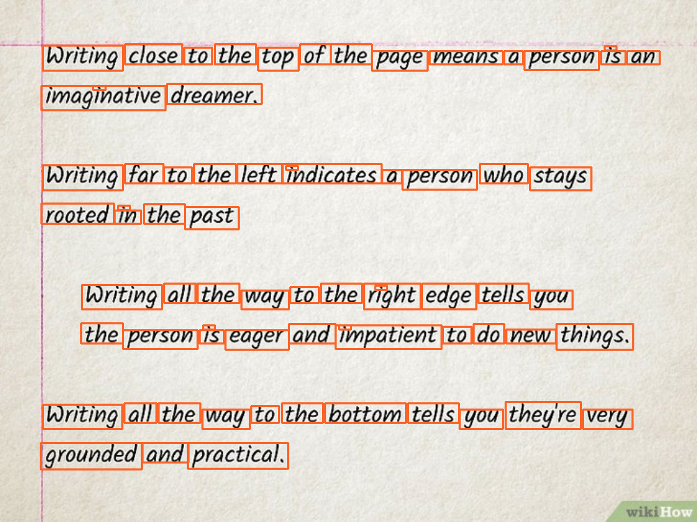

# Image Detection Readme

This Python script provides a simple image processing tool for detecting and highlighting lines and words in images. It uses the OpenCV library for image processing and Matplotlib for displaying the results.

## Usage

To use the script, follow these steps:

### Prerequisites

Make sure you have the necessary libraries installed before running the script. You can install them using:

```bash
pip install opencv-python numpy matplotlib

```

### Running the Script

To use the script, follow these steps:

1. Clone the repository:

```bash
git clone https://github.com/MohamedHamed12/Computer_vision
```

2. Navigate to the script directory:

```bash
cd Computer_vision/detect_words
```


3. Run the script with the following command:

```bash
python script_name.py [input_path] [output_path]

```

- `input_path` (optional): Path to the directory containing input images.

- `output_path` (optional): Path to the directory where output images will be saved.

## Credits

This script was created by [Mohamed Hamed](https://github.com/MohamedHamed12)

## License

This script is licensed under the [MIT license](LICENSE.txt).

